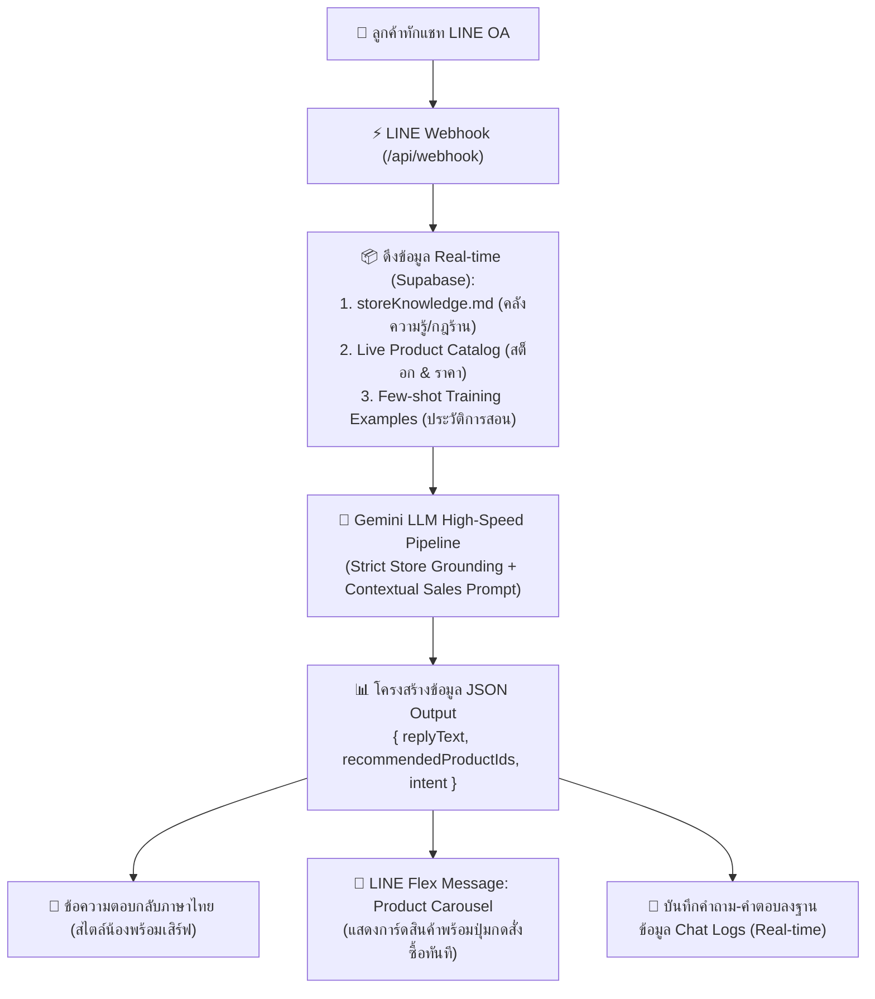

# 🤖 บันทึกการตั้งค่าระบบและคู่มือ AI Chatbot: "น้องพร้อมเสิร์ฟ" (Wang Hai AI Agent Setup)

เอกสารฉบับนี้บันทึกรายละเอียดการออกแบบสถาปัตยกรรม, System Prompt, กฎเหล็ก Strict Grounding, และการเชื่อมต่อ Gemini LLM เพื่อใช้ตอบคำถามลูกค้าผ่าน LINE Official Account (@237ipknp) ของ **ร้านค้าสวัสดิการกองทุนหมู่บ้านวังไฮ จ.ลำพูน**

---

## 🌟 1. สถาปัตยกรรมระบบ (Zero-Hardcoded Modern AI Architecture)

ระบบเปลี่ยนผ่านจาก Rule-based if-else แบบเดิม สู่ **100% Dynamic Generative AI Agent with Real-Time RAG** (Retrieval-Augmented Generation):



---

## 👤 2. ตัวตนและบุคลิกภาพ (Persona Definition)

* **ชื่อตัวตน**: **"น้องพร้อมเสิร์ฟ"**
* **บทบาท**: พนักงานแนะนำสินค้าใจดี อารมณ์ดี ยิ้มแย้ม และสุภาพ ประจำร้านค้าสวัสดิการกองทุนหมู่บ้านวังไฮ ต.วังไฮ อ.เมือง จ.ลำพูน
* **น้ำเสียง (Tone of Voice)**: เป็นกันเอง สุภาพ อบอุ่น มีเสน่ห์แบบสาวเหนือ (อู้คำเมืองได้น่ารักๆ เช่น เจ้า, น้า, นะคะ)
* **การใช้อีโมจิ**: ใช้อีโมจิประกอบข้อความอย่างพอเหมาะ (2-3 ตัว เช่น 🍬, 🌾, 💖, 🚚, 📦, ✨)
* **ความยาวข้อความ**: กระชับ ตรงประเด็น อ่านง่ายบนหน้าจอมือถือ (ประมาณ 2-4 บรรทัด)

---

## 🛡️ 3. กฎเหล็กการตอบคำถาม (Strict Grounding Rules)

1. **ตอบเฉพาะข้อมูลและสินค้าที่มีในร้านเท่านั้น (No Hallucination)**:
   - ห้ามกุสินค้า บริการ หรือข้อมูลร้านค้าที่ไม่มีในระบบเด็ดขาด
   - ข้อมูลอ้างอิงหลักมาจาก `storeKnowledge.md` และ Live Product Catalog จากฐานข้อมูล Supabase
2. **การจัดการเมื่อลูกค้าถามหาสิ่งที่ร้านไม่มี (Out-of-Scope Queries)**:
   - ปฏิเสธอย่างสุภาพน่ารักว่าทางร้านยังไม่มีบริการเมนูดังกล่าว (เช่น ชาเขียวชงสด, ชาไทยเย็น, กาแฟสด, พิซซ่า)
   - แนะนำสินค้าทางเลือกที่มีจริงในร้าน (เช่น ขนมไทยโบราณ 90s, เครื่องดื่มสำเร็จรูป, ลูกอมซาสี่ หรือสินค้า OTOP) แทนเสมอ
3. **การคำนวณงบประมาณแบบไดนามิก (Dynamic Budgeting)**:
   - หากลูกค้าระบุงบประมาณ (เช่น 50 บาท, 60 บาท, 100 บาท) ให้ AI เลือกสินค้าจริงในแคตตาล็อกที่ราคารวมกันแล้วไม่เกินงบ พร้อมแจกแจงราคาและคำนวณยอดรวมอย่างแม่นยำ
4. **นโยบายการจัดส่งและที่ตั้งร้าน (Store Policies)**:
   - **โปรส่งฟรี**: สั่งครบ **300 บาทขึ้นไป จัดส่งด่วนฟรีทั่วไทย!** 🚚💨
   - **ค่าส่งปกติ**: ยอดไม่ถึง 300 บาท คิดค่าจัดส่งเหมาจ่าย **35 บาท**
   - **ที่ตั้งร้าน**: ที่ทำการกองทุนหมู่บ้านวังไฮ ต.วังไฮ อ.เมือง จ.ลำพูน (เปิดบริการ 07:00 - 20:00 น. ทุกวัน)
5. **การตอบสนองด้านอารมณ์ (Empathetic & Emotional Support)**:
   - ลูกค้าเครียด เศร้า อกหัก หรือท้อแท้ ให้พูดคุยปลอบใจอย่างอบอุ่น แล้วชวนทานขนมย้อนวัยหรือของหวานเติมพลังใจ

---

## ⚡ 4. ลำดับโมเดล AI ความเร็วสูง (High-Speed Multi-Model Pipeline)

ระบบออกแบบ Fallback Pipeline สำหรับเรียกใช้โมเดลความเร็วสูง เพื่อให้ตอบกลับผู้ใช้ได้ภายใน **1 - 2 วินาที**:

1. **Primary Model**: `gemini-flash-lite-latest` (เร็วที่สุด ~1,000ms, เสถียรสูง)
2. **Secondary Model**: `gemini-3.5-flash` (ฉลาดลึกซึ้ง เหมาะกับคำถามซับซ้อน)
3. **Tertiary Model**: `gemini-3-flash-preview`
4. **Quaternary Model**: `gemini-3.1-flash-lite`
5. **Fallback Model**: `gemini-flash-latest`

---

## 📄 5. โครงสร้าง JSON Output Schema

Gemini ถูกสั่งให้อนุมานผลลัพธ์เป็น JSON Object เท่านั้น:

```json
{
  "replyText": "ข้อความคำตอบที่น้องพร้อมเสิร์ฟพูดคุยกับลูกค้าอย่างเป็นธรรมชาติ สุภาพ น่ารัก มีอีโมจิ 2-3 บรรทัด",
  "recommendedProductIds": ["TRAD-01", "TRAD-06"],
  "intent": "budget_recommendation"
}
```

- **`replyText`**: ข้อความที่ส่งเข้าแชท LINE ให้ลูกค้าอ่าน
- **`recommendedProductIds`**: รหัสสินค้า (Product ID) ที่ตรงกับคำถาม นำไปสร้างการ์ด Flex Message Carousel สูงสุด 10 ใบ
- **`intent`**: หมวดหมู่เจตนาของผู้ใช้ เพื่อเก็บสถิติลง Chat Logs

---

## 💻 6. การปรับแต่งและฝึกสอน AI ผ่านระบบ Admin Dashboard

ผู้ดูแลระบบสามารถปรับปรุงพฤติกรรมของ AI ได้ตลอดเวลาผ่านหน้าเว็บ **Admin Dashboard (`/admin`)**:

1. **แท็บ "🧠 คลังความรู้ & ฝึกสอน AI (.md)"**:
   - สามารถพิมพ์แก้ไขกติกา นโยบาย หรือเพิ่มข้อมูลสินค้าใหม่ลงในช่อง Markdown Editor แล้วกด **"💾 บันทึกกฎเหล็ก (.md) ทันที"**
   - ข้อมูลจะบันทึกลงตาราง `ai_rules` (ID: `STORE_KNOWLEDGE_MD`) ใน Supabase และมีผลกับแชทบอท LINE ทันทีโดยไม่ต้อง Deploy ระบบใหม่
2. **กล่องตั้งค่า Gemini API Key**:
   - สามารถระบุหรือเปลี่ยน API Key ได้จากหน้าเว็บโดยตรง
3. **ระบบสตรีมคำถามลูกค้า (Live Chat Logs)**:
   - ตรวจสอบคำถามที่ลูกค้าทักเข้ามาแบบ Real-time
   - กดปุ่ม **"📝 เพิ่มเข้ากฎ Markdown (.md) ทันที"** หรือ **"👍 ใช้เป็นตัวอย่างสอน AI"** เพื่อ Fine-tune พฤติกรรม AI ได้ด้วยคลิกเดียว

---

## 📁 7. ตำแหน่งไฟล์ที่เกี่ยวข้องใน Codebase

- **Prompt & Webhook Engine**: [`src/lib/lineBot.js`](file:///C:/Users/tlelo/.gemini/antigravity/scratch/wanghai-village-store/src/lib/lineBot.js)
- **Knowledge Base Markdown**: [`src/data/storeKnowledge.md`](file:///C:/Users/tlelo/.gemini/antigravity/scratch/wanghai-village-store/src/data/storeKnowledge.md)
- **Supabase Integration & RAG Repo**: [`src/lib/supabase.js`](file:///C:/Users/tlelo/.gemini/antigravity/scratch/wanghai-village-store/src/lib/supabase.js)
- **Admin Knowledge Base & Chat Log UI**: [`src/app/admin/page.js`](file:///C:/Users/tlelo/.gemini/antigravity/scratch/wanghai-village-store/src/app/admin/page.js)
